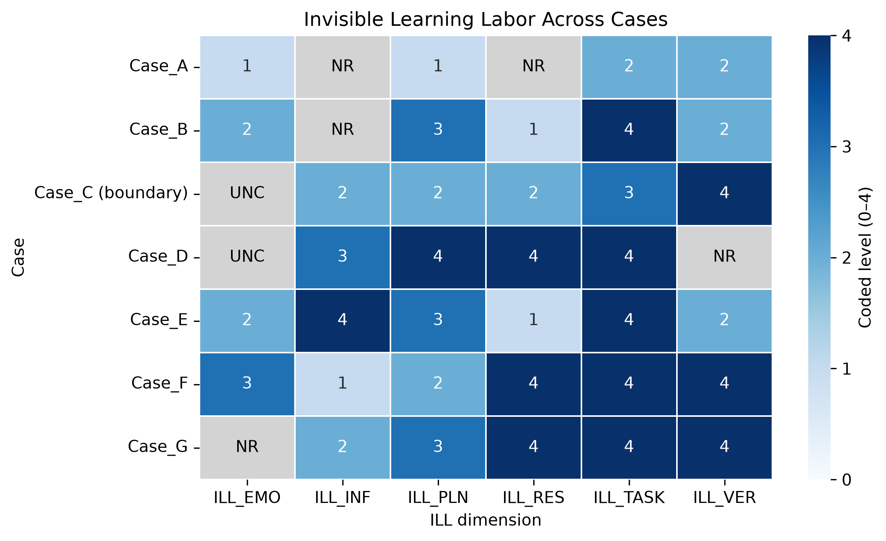

# standardized-test-fairness
## Invisible Learning Labor Visualization

Darker blue indicates a higher ordinal coded level within each dimension (0–4). Gray cells indicate NR (not reported) or UNC (unclear), neither of which is treated as 0. Case_C is a boundary case.

The figure describes these seven cases and should not be generalized to all students.

See the [analysis notebook](notebooks/01_data_overview.ipynb) for the plotting steps and initial observation.